# PowerStones
Minecraft mod with overlapping wires of Redstone, Bluestone, Greenstone and Yellowstone

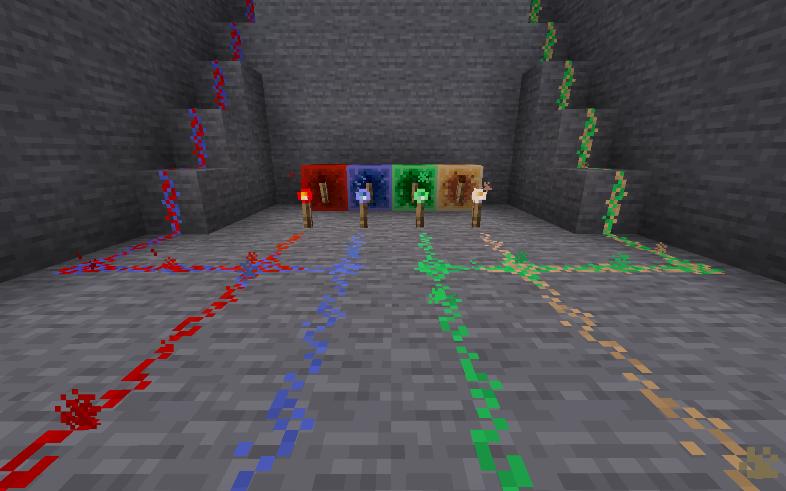

## Modding platforms

- Modrinth: https://modrinth.com/mod/powerstones
- CurseForge: https://www.curseforge.com/minecraft/mc-mods/cmt-powerstones

## Dependencies

Mods needed to be installed in order for PowerStones to function correctly:

| Mod           | Version          | Reason |
| ------------- | ---------------- | ------ |
| [Fabric API]  | >=0.75.3+1.19.4  | Essential for Fabric mods to work. |

[Fabric API]: https://modrinth.com/mod/fabric-api

## Compatibility

PowerStones is compatible with other redstone mods, such as Red Bits or Redstone Bits.

It is intended to make PowerStones compatible with as much other mods as possible, but this will take some time.

If there is a mod that you like which seems incompatible with PowerStones, please make an new issue on GitHub using the "Mod compatibility request".

## Features

### Blocks and items

| Name              | Image | Crafting recipes |
| ----------------- | ----- | ---------------- |
| Redstone          |  | 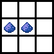 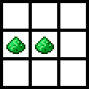 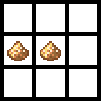 |
| Bluestone         |  |  
| Greenstone        |  | 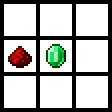 
| Yellowstone       |  | 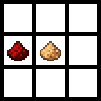 
| Bluestone Block   |  | 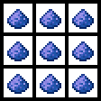
| Greenstone Block  |  | 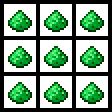
| Yellowstone Block |  | 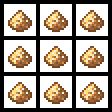
| Bluestone Torch   |  | 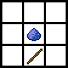
| Greenstone Torch  |  | 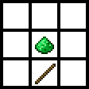
| Yellowstone Torch |  | 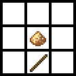

### Functionalities

 - Powerstone wires are overlappable by pairs. Redstone and Bluestone wires can overlap each other. Similarly, Greenstone and Yellowstone wires can overlap each other as well.
 - Hitting powerstone wires while holding a powerstone wire item will only break equally coloured powerstone wires than the one held in the main hand.
 - Powerstone blocks and powerstone torches only give power to powerstone wires of the same colour.

## Implementation process and limitations

The initial idea was to be able to place all four powerstone wires on a single block. This meant that the redstone wire block would have had more than 5 308 416 states (3x3x3x3x16x16x16x16) compared to its unmoded version of 1 296 states (3x3x3x3x16). As all states of all the game's blocks are computed on startup, this would have taken more computation time and memory than a computer can handle.

In order to keep the initial idea, an effort was made to limit the powerstone's power to two states (0-1), instead of sixteen (0-15). This lowered the number of states for the redstone wire block down to its unmoded version of 1 296 states (3x3x3x3x2x2x2x2). However, this number of states would not have been final as more would have been added to display all possible connections. Eventually, the implementation proved itself too complicated and unreasonable to continue, as it required an overhaul of the redstone wire block's power updates and removed all vanilla redstone functionalities related to redstone power levels.

The idea of having overlappable powerstones still viewed as a goal, an attempt to first add bluestone on top of redstone was made with success through the addition of another power property and the incrementation of both power properties by one. Thus, the number of states for the redstone wire block was of 23 409 (3x3x3x3x17x17), which only added a couple of seconds more to the loading time.

Extending the mod with greenstone and yellowstone wires could not have been achieved through the addition of two more power properties for the same reason as stated in the initial idea (too many states). The choice had then been made to make wires overlappable by pairs. Redstone wires would be overlappable with bluestone wires, while greenstone wires would be overlappable with yellowstone wires. This was easily achievable through the addition of a single property with two states (one state per pair of powerstones), ending with a number of states for the redstone wire block of 46 818 (3x3x3x3x17x17x2). Adding this basic property rendered the game's startup slower (~1mn30s). However, with higher concern, the number of memory (RAM) needed in order for the game to load every state approximated 12GB. Even if asking users to add a simple Java argument in the Minecraft's launcher to extend the maximum amount of allocated memory to the game is done for other mods, 12GB of memory is huge in comparison to the small addition this mod would have brought to the game.

As the powerstone pair property seemed like a good settle point to bring the project as close to the initial goal as it could have after six weeks of learning and developping, the decision was taken to find a mod which could considerably reduce the amount of memory allocated to run the game with PowerStones. After a quick search, [FerriteCore] seemed adequate and, against all expectations, made it possible for the game to run with PowerStones wihtout changing the maximum amount of allocated memory (<4GB). Although PowerStones has become dependent of a performance mod, users can benefit from it without worrying about memory consumption.

PowerStones was initially developed to be used with Fabric and largely relied on mixins. After a sufficiently successful start of the mod and wanting to make it useable with Forge, help was sought on the Forge Discord. However, asking mixin related questions only brought criticism towards the [O-So-Cursed-Mixin] reliance of PowerStones. Although the suggestions were helpful in their depth, their arrogant form and suppositions could have been left behind. In spite of this unpleasant experience with some of Forge's community, time and rational reasoning proved to show that using each mod loader's API and separate powerstone classes instead of overrelying on mixins would be best, not only to make it available through Forge, but also to minimise bugs and maximise mod compatibility. An overhaul of the mod then took place to apply these necessary changes.

With the high number of states introduced by the implementation, the dependency on FerriteCore became a necessary compromise rather than an optional optimisation. However, it also highlighted the need for a more sustainable architectural approach. A logical next step for PowerStones was therefore to refactor the MultipleWires system into a BlockEntity-based implementation, an approach that several users had already identified as essential for reducing state complexity while improving overall performance and extensibility. In this context, a contributor from the community, [AtronixMH48], offered valuable assistance by providing a modified version of the mod featuring a BlockEntity-driven solution. This contribution was carefully reviewed to ensure full understanding of its mechanics and was partially refined before being integrated into the project, ultimately removing PowerStones’ dependency on FerriteCore.

[FerriteCore]: https://modrinth.com/mod/ferrite-core
[O-So-Cursed-Mixin]: https://discord.com/channels/313125603924639766/983834532904042537/1093992576211763241

## Colour choices

The colours blue, green and yellow were chosen around the year 2012, when this project first came into mind. One of the goals was to make better application of poorly used and almost unuseful, but abundant resources such as lapis lazuli, emerald and glowstone dust.

Each new powerstone colour comes from a combination of the redstone's colour and the resource's colour used in the powerstone's recipe. First, the powerstone texture was coloured with the resource's colour. Then, the redstone's texture was layered above it before finally applying to the redstone layer a colour dodge blending filter with ~30% opacity (75/255).

## Contributions

Please discuss substantial features before implementing them.

Unsolicited feature pull requests may be declined even if they are technically correct.

Bug fixes, small compatibility fixes, and well-scoped improvements are generally more likely to be accepted.

### Contributors

- [CalvinMT] (Author)
- [AtronixMH48] (Refactor `MultipleWiresBlock` to a Block Entity)

[CalvinMT]: https://github.com/CalvinMT
[AtronixMH48]: https://github.com/MokkaHornisse48
